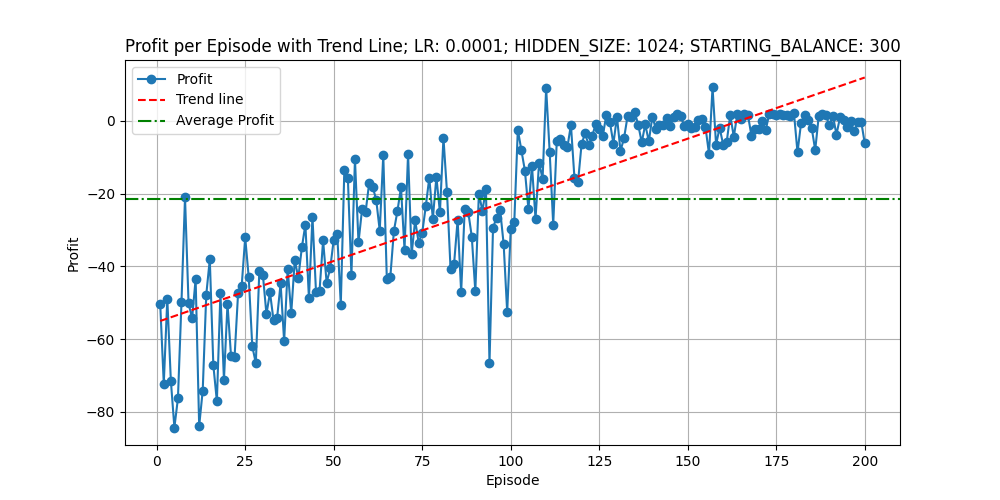

As of yet really not finished training to create improvement in a strategy of Forex trading.

Most importantly, it should now get real testing over varying datasets (not just one over and over again). Datasets generated using MQL5.

But, well, I am aware that putting real funds in such pursuits is ultimately futile anyway - unlike these hyped-up guys (hyped up traditionally by investment types + AI ideas nowadays)...

Trying to outplay the market-maker kings holding the sway over the countries is a naive misconception (or the true professionals having the best data).

